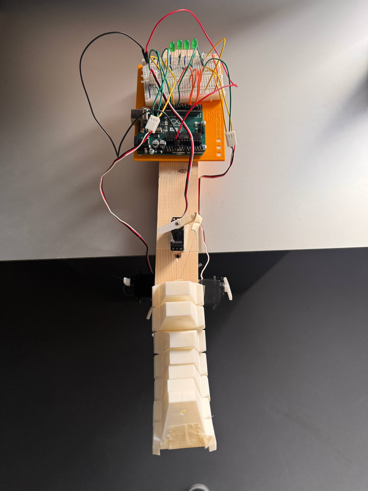
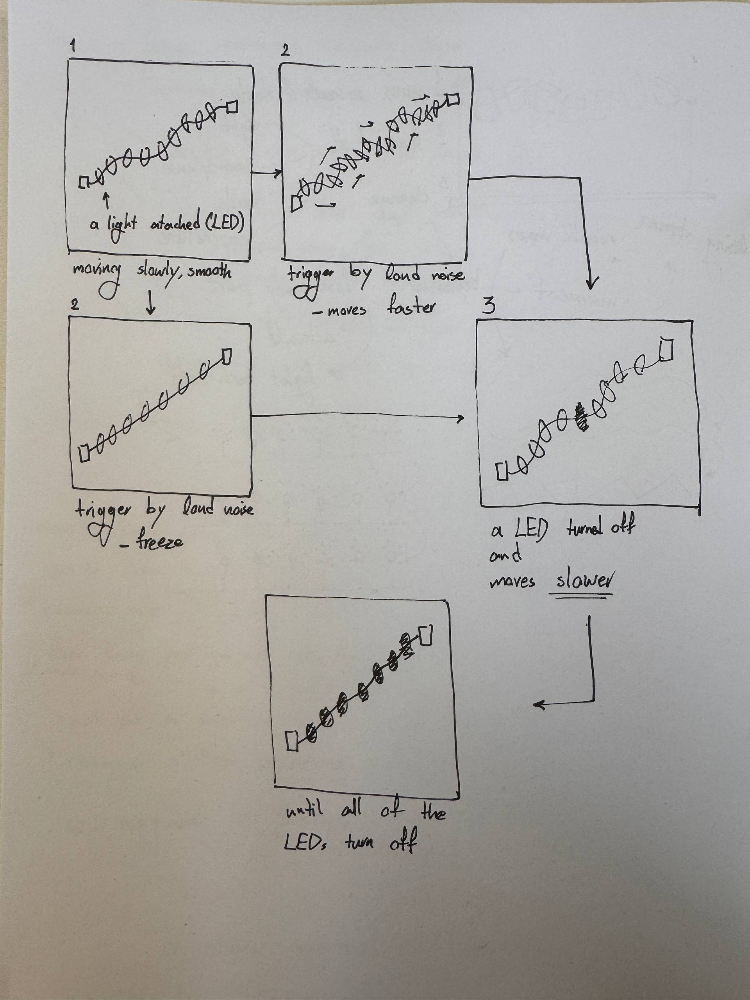
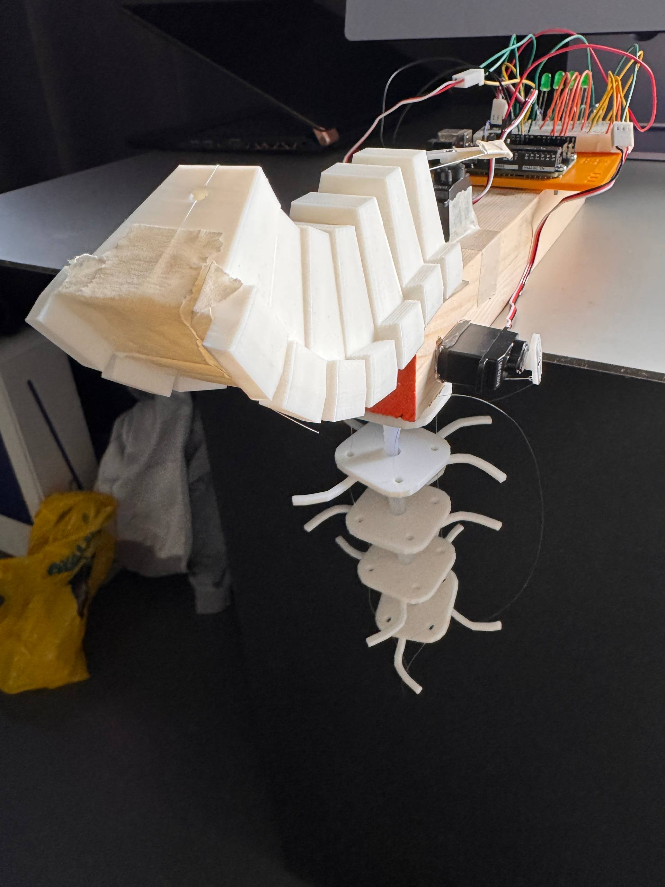

# Traumatized Fish: A Body That Remembers



## Concept

This project explores **fear as a long-term, damaging process** rather than a single dramatic reaction.  
Inspired by marine biology and trauma theory, the work treats fear as **erosion of capacity** instead of visible spectacle.

Research on sea animals shaped the conceptual model:

- **Sea slugs (Aplysia):** repeated stress weakens neural reflexes over time. Fear becomes **stored memory**.  
- **Octopus:** survival through **sacrificing a part**, accepting permanent loss.  
- Deep-sea organisms: distress expressed through **light and shutdown**, not aggression.

The installation translates these behaviors into a mechanical system where interaction slowly degrades the creature.

---

## Trigger

**Noise** is used as the main trigger.

- Sudden sound in oceans = predators / boats / explosions  
- Causes freezing, disorientation, long-term stress  
- Directly linked to human activity → audience becomes participant


---

## Final Prototype

### Behavior Flow

`sound → freeze → partial loss → permanent degradation`



### Two-Part Creature

**Upper Body – Memory Model (Sea Slug Reference)**  
- Gradual slowing after each trigger  
- Reduced range and speed  
- Represents accumulated trauma

**Lower Body – Immediate Model**  
- Instant reaction only  
- No memory  
- Contrast between short-term and long-term fear

### Representation of Loss

- LEDs switching off sequentially  
- Movement amplitude reduction  
- Increasing mechanical delay  
- Final irreversible shutdown



---

## Development Process

### Mechanical Experiments

- Sinusoidal / phase-lag movements  
- Breathing mechanisms  
- Delayed return (lag)  
- Asymmetric degradation


### Coding

- Arduino control  
- Browser-based sound analysis  
- Progressive degradation algorithm  
- Alternating & overlapping servo logic

### Form & 3D Modeling

- Multiple body morphologies  
- Soft vs semi-rigid skins  
- Lightweight structure  
- Separation of memory / immediate zones


---

## Technical Overview

**Inputs**
- Microphone (threshold detection)
- Visual feedback interface

**Outputs**
- Servo motors  
- LED system  
- Internal state memory

**Core Logic**
```text
if sound > threshold:
    freeze()
    degrade()
```

## Bibliography

**Marine Biology & Fear Responses**

- Big Think. *Sea Slugs and the Nature of Consciousness.*  
  https://bigthink.com/books/sea-slugs-and-the-nature-of-consciousness/

- Scientific American. *What Sea Slugs Tell Us About Memory.*  
  https://www.scientificamerican.com/article/what-sea-slugs-tell-us-about-memory/

- Smithsonian Magazine. *Severed Octopus Arms Have a Mind of Their Own.*  
  https://www.smithsonianmag.com/smart-news/severed-octopus-arms-have-a-mind-of-their-own-2403303/

- National Geographic. *Octopus Facts and Defense Behaviors.*  
  https://www.nationalgeographic.com/animals/invertebrates/facts/octopus-facts/

- MBARI. *Atolla wyvillei – Bioluminescent Alarm Display.*  
  https://www.mbari.org/animal/atolla-wyvillei/

**Noise as Trigger**

- NOAA. *How Noise Affects Marine Life.*  
  https://oceanservice.noaa.gov/facts/ocean-noise.html

- Nature Scientific Reports. *Noise Pollution Alters Fish Behavior.*  
  https://www.nature.com/articles/s41598-018-32417-8

- Ocean.si.edu. *Lanternfish and Deep-Sea Light Sensitivity.*  
  https://ocean.si.edu/ocean-life/fishes/lanternfish

**Soft Robotics & Kinetic Art**

- ResearchGate. *Soft Robotics and Bio-Inspired Movement.*  
  https://www.researchgate.net/topic/Soft-Robotics

- Journal of Experimental Biology. *Autotomy and Regeneration in Cephalopods.*  
  https://journals.biologists.com/jeb


